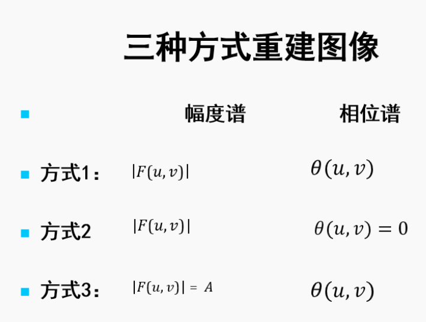

# ImageProcessing

 Homework repository for Image Processing Lesson

### Homework 1

使用python对随机一张灰度图像进行线性、分段线性、非线性的点运算。

### Homework 2

使用python编程实现（可以不使用工具包提供的函数）图像的平移，镜像和旋转，以及这三种几何变换的复合。

### Homework 3

使用python编程实现以下三种情况的傅里叶反变换，进而比较复原图像的区别，理解傅里叶变换后的幅度谱和相位谱。

### Homework 4

复现何凯明*Single Image Haze Removal Using Dark Channel Prior*论文中图像去雾算法。

### Homework 5

使用python实现维纳滤波，要求：比较信噪比未知，信噪比已知，图像和噪声自相关函数已知，这三种情况下的图像复原结果。
